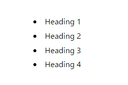

## はじめに

今回、ブログに目次 (Table of Contents) を実装したので、その方法を解説します。

**Content Collections**を使用していることを前提としています。


## headings (見出し) を取得する

まず、目次を実装するうえで必ず必要なのが記事内のheadings (見出し) です。

本ブログはAstroのContent Collectionsを使用してMDXでブログを執筆しており、
`astro:content`ではheadingsが以下のように実装されています。

```ts title="hoge.ts" {2}
// node_modules/(略)/markdown-remark/types.d.ts
export interface MarkdownHeading {
  depth: number; // 見出しのレベル
    slug: string; // 見出しのスラッグ (urlのフラグメントに使用する)
    text: string; // 見出しのテキスト
}
```

`MarkdownHeading`には、見出しテキストだけでなく、見出しのレベルやスラッグも含まれているので、CSSを使って見出しを装飾するなどの工夫も可能です。

実際にはこの配列、つまり`MarkdownHeading[]`として利用することができます。

そして、AstroのContent Collectionsでは、`ContentEntryMap`型を利用して各記事のheadingsを取得することができます。

今回の記事では上記の方法を使用して、目次を実装する方法を説明します。

## ContentEntryMap 型での実装

`CollectionEntry<"YOUR_COLLECTION_NAME">`に含まれる`ContentEntryMap`型に実装された、`render`メソッドを使用して目次を実装します。

具体的には、`ContentEntryMap`型に実装された`render`メソッドの返り値に`headings: MarkdownHeading[]`が含まれているので、これを利用します。

```ts showLineNumbers
// .astro/types.d.ts

export type CollectionEntry<C extends CollectionKey> = Flatten<AnyEntryMap[C]>;
type AnyEntryMap = ContentEntryMap & DataEntryMap;

type ContentEntryMap = {
  "YOUR_COLLECTION_NAME": {
    "1970-01-01/index.mdx": { // 例示用のファイルパス
      // 省略
    } & { render(): Render[".mdx"] }; // .mdxの場合のrenderメソッド（.mdでも特に変わりません）
    // 省略
  }
}

// Render型の定義 (.mdも同様)
declare module 'astro:content' {
  interface Render {
    // `Render`型は`Promise`を返す。
    '.mdx': Promise<{
      Content: import('astro').MarkdownInstance<{}>['Content'];
			headings: import('astro').MarkdownHeading[];
			remarkPluginFrontmatter: Record<string, any>;
		}>;
	}
}
```

この`headings`を`[slug].astro`などで取得することで、目次一覧を用いた目次を実装することができます。

ここでは、`[slug].astro`での実装方法を説明します。

コード内の`BaseLayout`は例示用のダミーです。
適宜、自身で定義したLayoutコンポーネントを使用してください。


```tsx
// [slug].astro
---
import type { CollectionEntry } from "astro:content";

type Props = CollectionEntry<"blog">;

const post = Astro.props;

const { Content, headings } = await post.render();
---

<BaseLayout>
  <!-- 目次部分開始 -->
  <ul>
  {
    headings.map(({depth, slug, text}) => {
      <li>
        <a href={`#${slug}`}>
          {text}
        </a>
      </li>
    })
  }
  </ul>
  <!-- 目次部分終了 -->
  <Content />
</BaseLayout>
```

これで、このようなの場合

```mdx
---
{/* 略 */}
---
# Heading 1

## Heading 2

### Heading 3

#### Heading 4
```

このような目次を作成することができます。



もちろん記事用のLayoutコンポーネントを作成して、そのコンポーネントにheadingsを渡すこともできます。
このブログの場合は`[slug].astro`で記事用Layoutコンポーネントにheadingsを渡しています。

## まとめ

今回の記事ではAstroで目次を実装する方法を説明しました。

Content Collectionsを使用している場合、`CollectionEntry<"YOUR_COLLECTION_NAME">`の`render`メソッドを用いることで、記事の目次一覧を取得することができます。

次回の記事ではPanda CSSを使って目次を装飾する方法を説明します。
